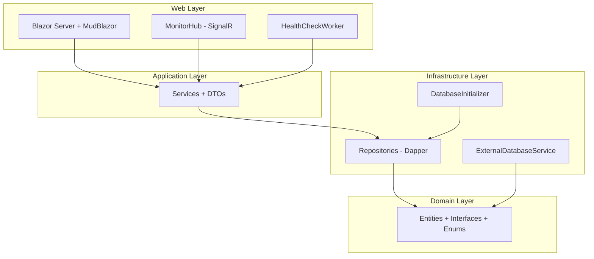
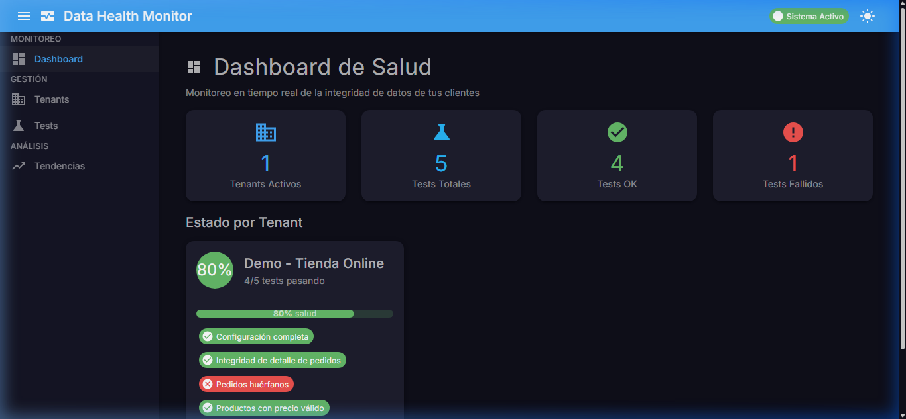
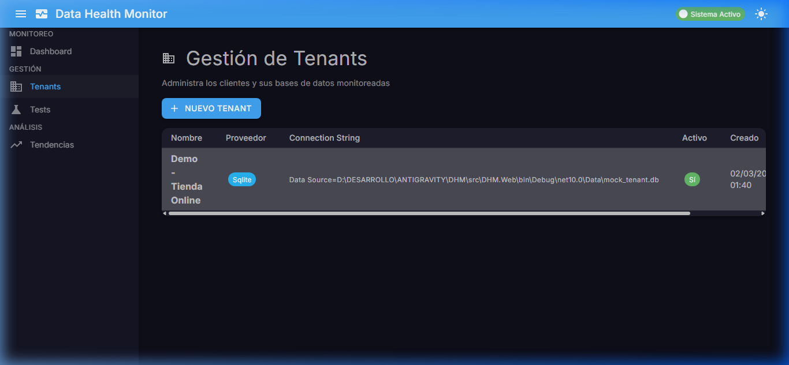
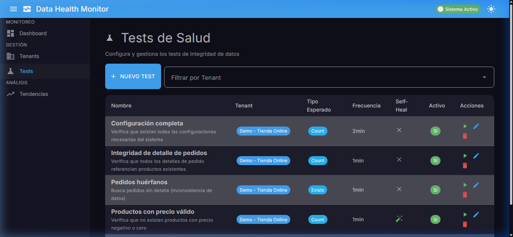

# Data Health Monitor (DHM) - Walkthrough

## Resumen

Se implementó el sistema completo **Data Health Monitor** con .NET 10, Blazor Server, MudBlazor, SignalR y SQLite, siguiendo **Clean Architecture** en 4 capas.

## Arquitectura



## Páginas Implementadas

````carousel

<!-- slide -->

<!-- slide -->

````

## Archivos Clave Creados

| Capa | Archivos | Propósito |
|------|----------|-----------|
| **Domain** | `Tenant.cs`, `HealthTest.cs`, `ExecutionLog.cs` | Entidades core |
| **Domain** | `DatabaseProvider.cs`, `ExpectedResultType.cs`, `TestStatus.cs` | Enums |
| **Application** | `TenantService.cs`, `TestExecutionService.cs`, `DashboardService.cs` | Lógica de negocio |
| **Infrastructure** | `DatabaseInitializer.cs`, `SqliteGuidTypeHandler.cs` | Persistencia SQLite |
| **Infrastructure** | `ExternalDatabaseService.cs` | Conexión a BDs externas |
| **Web** | `Home.razor` | Dashboard con SignalR |
| **Web** | `TenantList.razor`, `TenantFormDialog.razor` | CRUD Tenants |
| **Web** | `TestList.razor`, `TestFormDialog.razor` | CRUD Tests |
| **Web** | `TrendAnalysis.razor` | Gráficos de tendencia |
| **Web** | `MonitorHub.cs`, `HealthCheckWorker.cs` | Tiempo real |

## Errores Resueltos

1. **`InvalidCastException: String → Guid`** → Creado `SqliteGuidTypeHandler` para Dapper
2. **MudBlazor 9 breaking changes** → `ChartSeries<double>`, `ChartOptions` simplificado, `ShowMessageBox` → `ConfirmDialog`
3. **Razor parser conflicts** → Switch patterns con `<`/`>=` → métodos if/else
4. **`@bind-Value` + `ValueChanged` duplicado** → Usar solo `Value` + `ValueChanged`

## Cómo Ejecutar

```bash
cd d:\DESARROLLO\ANTIGRAVITY\DHM
dotnet run --project src\DHM.Web
# Navegar a http://localhost:5090
```

El sistema incluye un **tenant mock** ("Demo - Tienda Online") con base de datos SQLite de prueba que se genera automáticamente al iniciar.
